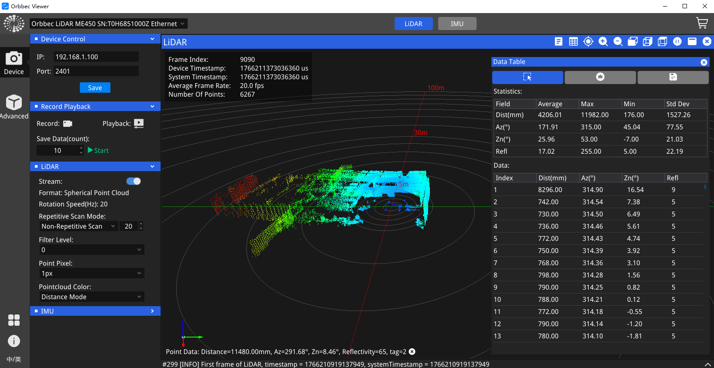

# LiDAR User Guide

Orbbec SDK v2.6.2 and later supports LiDAR devices like the Pulsar ME450 and SL450. It allows easy discovery and management of LiDAR hardware, real-time point cloud capture, and synchronized IMU measurements. Key features include flexible device configuration, real-time streaming, and recording/playback tools, facilitating development, testing, and deployment in robotics, mapping, and automation.

## Quick Start

If you want to get started with LiDAR examples from this repository:

1. Build the SDK with examples enabled
2. Open the LiDAR examples guide
3. Start with LiDAR quick start, then move to streaming, recording, and playback

```bash
cmake -S . -B build -DOB_BUILD_EXAMPLES=ON
cmake --build build --config Release
```

LiDAR examples guide:

- [examples/LiDAR_README.md](examples/LiDAR_README.md)

Recommended order:

1. `ob_lidar_quick_start`
2. `ob_lidar_stream`
3. `ob_lidar_device_control`
4. `ob_lidar_record`
5. `ob_lidar_playback`

## Sample

There are [several examples](examples/LiDAR_README.md) designed to help users learn LiDAR workflows such as point-cloud capture, IMU streaming, device control, recording, and playback.


## API User Guide
For information on the OrbbecSDK v2 architecture, SDK compilation, and API usage, refer to 
[LiDAR API User Guide document](https://orbbec.github.io/docs/OrbbecSDKv2_LiDAR_User_Guide/)


## OrbbecViewer Tool
[Orbbec Viewer](docs/tutorial/orbbecviewer.md#orbbecviewer-for-lidar) is a tool developed based on Orbbec SDK to help developers quickly use Orbbec's 3D sensor products.


## links
- [Pulsar ME450 Product](https://www.orbbec.com/pulsar-me450/)
- [Pulsar SL450 Product](https://www.orbbec.com/pulsar-sl450/)


