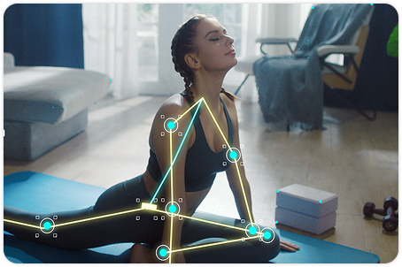
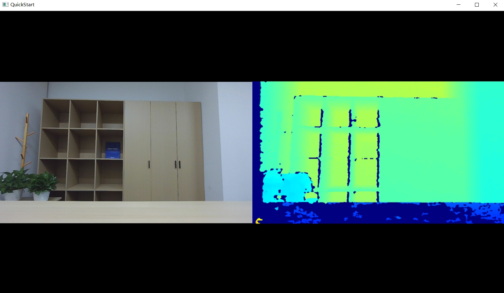
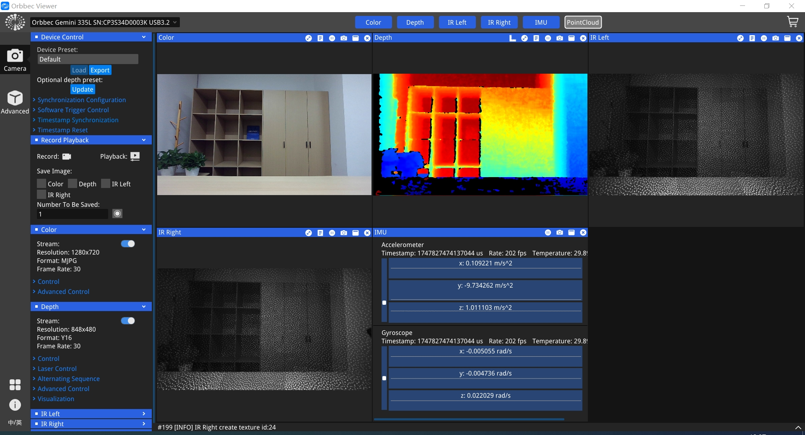

# Open Source Orbbec SDK v2.x

[](https://github.com/orbbec/OrbbecSDK_v2/releases)
[](LICENSE.txt)
[](https://orbbec.github.io/OrbbecSDK_v2/)
[](https://github.com/orbbec/OrbbecSDK_v2/issues)

Orbbec SDK v2 is an open-source, cross-platform SDK for Orbbec RGB-D and LiDAR devices.
It provides high-performance C/C++ APIs and language wrappers for building depth vision applications.


> [!IMPORTANT]
> This is the mainline README for Orbbec SDK v2.
>
> - Migration from SDK v1 to SDK v2: [docs/tutorial/migration_v1_to_v2.md](docs/tutorial/migration_v1_to_v2.md)
> - OpenNI device upgrade to UVC: [docs/tutorial/openni_to_uvc_upgrade.md](docs/tutorial/openni_to_uvc_upgrade.md)

> [!NOTE]
> LiDAR devices are supported in OrbbecSDK v2.6.2 and later. See [LiDAR_README.md](LiDAR_README.md) for details.

## Table of Contents

- [Core Features](#core-features)
- [Supported Devices and Platforms](#supported-devices-and-platforms)
- [SDK Installation](#sdk-installation)
- [Environment Setup](#environment-setup)
- [Quick Start](#quick-start)
- [Documentation](#documentation)
- [Tools](#tools)
- [Examples](#examples)
- [Contributing](#contributing)
- [License](#license)
- [Links](#links)

## Application Scenarios

<table align="center">
    <tr>
        <td align="center" width="33.33%">
            <br />
            Robotics
        </td>
        <td align="center" width="33.33%">
            <br />
            Logistics
        </td>
        <td align="center" width="33.33%">
            <br />
            Healthtech
        </td>
    </tr>
    <tr>
        <td align="center" width="33.33%">
            <br />
            Humanoid
        </td>
        <td align="center" width="33.33%">
            <br />
            Lawm-Mowers
        </td>
        <td align="center" width="33.33%">
            <br />
            Fitness
        </td>
    </tr>
</table>

## Core Features

> **See all SDK features:** [docs/sdk_feature_matrix.md](docs/sdk_feature_matrix.md)

## Supported Devices and Platforms

### Device Support Policy (v1 vs v2)

For the full v1 vs v2 support policy table and support-level definitions, see:[docs/supported_devices_firmware.md](docs/supported_devices_firmware.md)


### Supported Devices and Firmware


| Series              | Models & Buy Links                                                                 |
|---------------------|-----------------------------------------------------------------------------------|
| Gemini 305 Series   | [Gemini 305](https://store.orbbec.com/products/gemini-305) |
| Gemini 340 Series   | Gemini 345, Gemini 345Lg |
| Gemini 435 Series   | [Gemini 435Le](https://store.orbbec.com/products/gemini-435le) |
| Gemini 330 Series   | [Gemini 330 Series](https://store.orbbec.com/collections/gemini-330-series), [Gemini 330](https://store.orbbec.com/products/gemini-330), [Gemini 330L](https://store.orbbec.com/products/gemini-330l), [Gemini 335](https://store.orbbec.com/products/gemini-335), [Gemini 335L](https://store.orbbec.com/products/gemini-335l), [Gemini 335Le](https://store.orbbec.com/products/gemini-335le), [Gemini 336](https://store.orbbec.com/products/gemini-336), [Gemini 336L](https://store.orbbec.com/products/gemini-336l), [Gemini 335Lg](https://store.orbbec.com/products/gemini-335lg) |
| Gemini 2 Series     | [Gemini 2 Series](https://store.orbbec.com/collections/gemini-2-series), [Gemini 2](https://store.orbbec.com/products/gemini-2), [Gemini 2L](https://store.orbbec.com/products/gemini-2l), [Gemini 215](https://store.orbbec.com/products/gemini-215), Gemini 210 |
| Femto Series        | Femto Bolt, Femto Mega, Femto Mega I |
| Astra Series        | Astra 2 |
| Astra Mini Series   | Astra mini Pro, Astra mini S Pro |
| LiDAR Series        | [dToF LiDAR Pulsar SL450](https://store.orbbec.com/products/dtof-lidar-pulsar-sl450), [dToF LiDAR Pulsar ME450](https://store.orbbec.com/products/pulsar-me450) |

> **See detailed device/firmware support matrix:** [docs/supported_devices_firmware.md](docs/supported_devices_firmware.md)

### Supported Platforms

| Platform      | Supported Versions / Models                                                      |
|--------------|----------------------------------------------------------------------------------|
| Windows      | Windows 10, Windows 11 (x86, x64)                                                 |
| Linux x86-x64| Ubuntu 20.04, Ubuntu 22.04, Ubuntu 24.04                                          |
| Arm Linux    | Jetson AGX Orin, Jetson Orin NX, Orin Nano, AGX, Xavier, Xavier NX, Jetson Thor   |
| Android      | Android 13 (see [OrbbecSDK-Android-Wrapper](https://github.com/orbbec/OrbbecSDK-Android-Wrapper/tree/v2-main)) |
| macOS        | Apple M2, macOS 13.2                                                             |


## SDK Installation

### Install from Binary Packages

If you do not plan to modify SDK source code, install from pre-compiled packages:

- [OrbbecSDK_v2 Releases](https://github.com/orbbec/OrbbecSDK_v2/releases)

Package formats:

1. Windows x64: `OrbbecSDK_vx.x.x_win64.exe`
2. Linux x86_64: `OrbbecSDK_vx.x.x_amd64.deb`
3. Linux ARM64: `OrbbecSDK_vx.x.x_arm64.deb`

### Install from Source

If you need custom modifications or deep integration, build from source:

- Build guide: [docs/tutorial/building_orbbec_sdk.md](docs/tutorial/building_orbbec_sdk.md)

## Environment Setup

Use the one-click setup script for your platform. The commands below are ready to paste.

### Windows

Register metadata required by frame synchronization and timestamp correctness:

```powershell
Set-ExecutionPolicy -ExecutionPolicy RemoteSigned -Scope CurrentUser
powershell -ExecutionPolicy Bypass -File .\scripts\env_setup\setup.ps1
```

- [scripts/env_setup/obsensor_metadata_win10.md](scripts/env_setup/obsensor_metadata_win10.md)

### Linux

Install udev rules to access devices without running all apps as root:

```bash
bash ./scripts/env_setup/setup.sh
```

## Quick Start

Minimal C++ sample:



```cpp
// Create a pipeline.
ob::Pipeline pipe;

// Start the pipeline with default config.
pipe.start();

// Create a window for showing the frames, and set the size of the window.
ob_smpl::CVWindow win("QuickStart", 1280, 720, ob_smpl::ARRANGE_ONE_ROW);

while(win.run()) {
    // Wait for frameSet from the pipeline, the default timeout is 1000ms.
    auto frameSet = pipe.waitForFrameset();

    // Push the frames to the window for showing.
    win.pushFramesToView(frameSet);
}

// Stop the Pipeline, no frame data will be generated.
pipe.stop();
```

## Documentation

- Docs portal: [GitHub Pages](https://orbbec.github.io/OrbbecSDK_v2/)
- Installation and development guide: [docs/tutorial/installation_and_development_guide.md](docs/tutorial/installation_and_development_guide.md)
- API user guide: [Orbbec SDK v2 API User Guide](https://orbbec.github.io/docs/OrbbecSDKv2_API_User_Guide/)
- API reference: [Orbbec SDK v2 API Reference](https://orbbec.github.io/docs/OrbbecSDKv2/index.html)
- FAQ: [docs/FAQ.md](docs/FAQ.md)

## Tools

- Orbbec Viewer: [docs/tutorial/orbbecviewer.md](docs/tutorial/orbbecviewer.md)
- Depth Quality Tool: [DepthQualityTool](https://github.com/orbbec/OrbbecTools/releases/tag/DepthQualityTool)



If firmware file picker does not appear on Linux in Orbbec Viewer, install Zenity:

```bash
sudo apt-get install zenity
```

## Examples

- Examples overview: [examples/README.md](examples/README.md)
- Wrappers overview: [wrappers/README.md](wrappers/README.md)
- LiDAR usage: [LiDAR_README.md](LiDAR_README.md)

## Contributing

Current focus is internal SDK development, but pull requests and suggestions are welcome.

- Contribution guide: [CONTRIBUTING.md](CONTRIBUTING.md)
- Issue tracker: [GitHub Issues](https://github.com/orbbec/OrbbecSDK_v2/issues)

## License

This project is licensed under MIT with additional third-party licenses.
See [LICENSE.txt](LICENSE.txt) for details.

## Links

- [Orbbec SDK v2 Open Source Repository](https://github.com/orbbec/OrbbecSDK_v2)
- [Orbbec SDK v1 Pre-Compiled Repository](https://github.com/orbbec/OrbbecSDK)
- [Orbbec Company Website](https://www.orbbec.com/)
- [Orbbec 3D Club](https://3dclub.orbbec3d.com)
