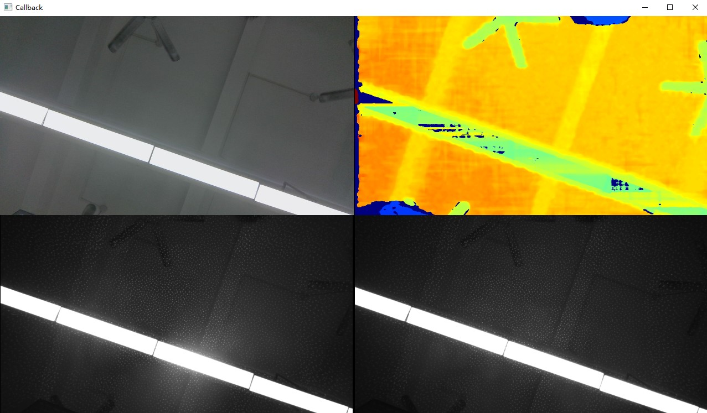

# Callback

This example shows how to start a pipeline in callback mode and render the latest frames in a window.
Use it when you want to build an application that processes frames asynchronously instead of polling in the main loop.

## When To Use It

- learn the callback-based pipeline pattern
- add your own processing logic inside the frame callback
- separate frame acquisition from UI rendering

## Supported Devices

| Device Series | Models |
|---------------|--------|
| Gemini 330 Series | Gemini 330, Gemini 330L, Gemini 335, Gemini 335L, Gemini 335Le, Gemini 336, Gemini 336L, Gemini 335Lg |
| Gemini 305 Series | Gemini 305 |
| Gemini 340 Series | Gemini 345, Gemini 345Lg |
| Gemini 435 Series | Gemini 435Le |
| Gemini 2 Series | Gemini 2, Gemini 2L, Gemini 215, Gemini 210 |
| Femto Series | Femto Bolt, Femto Mega, Femto Mega I |
| Astra Series | Astra 2 |
| Astra Mini Series | Astra Mini Pro, Astra Mini S Pro |

> Refer to the [Supported Devices and Firmware](https://github.com/orbbec/OrbbecSDK_v2?tab=readme-ov-file#supported-devices-and-firmware) section in the main README for more details.

## Prerequisites

- Build the examples from the repository root as described in [../../README.md](../../README.md)
- OpenCV is required for the preview window

## Build & Run

```bash
cmake -S . -B build -DOB_BUILD_EXAMPLES=ON -DOpenCV_DIR=/path/to/opencv
cmake --build build --config Release --target ob_callback
```

```bash
.\build\win_x64\bin\ob_callback.exe     # Windows
./build/linux_x86_64/bin/ob_callback    # Linux x86_64
./build/linux_arm64/bin/ob_callback     # Linux ARM64
./build/macOS/bin/ob_callback           # macOS
```

## Operation

- The sample automatically enables available video sensors.
- Frames are received in a callback and displayed in the preview window.
- Press `Esc` in the window to exit.

## Notes

- Keep callback work lightweight. Long-running processing inside the callback can cause frame drops.
- For heavier processing, use a queue and hand off work to another thread.

## Result


