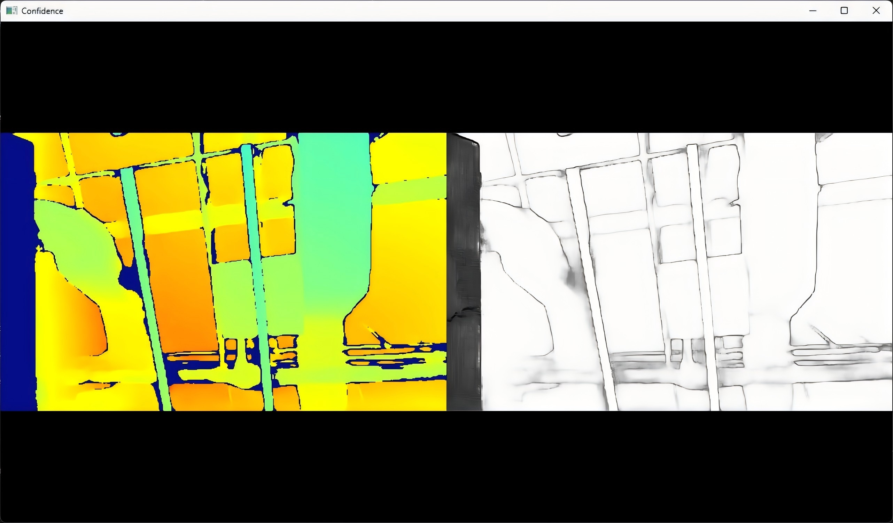

# Confidence

This sample displays the depth stream together with the confidence stream from a supported device.
Use it when you want to understand confidence output and compare it with the corresponding depth image.

## When To Use It

- inspect a device that exposes a confidence sensor
- compare confidence output with depth output
- validate depth-confidence pairing on supported hardware

## Prerequisites

- Build the examples from the repository root as described in [../../README.md](../../README.md)
- OpenCV is required for the display window
- The connected device must provide a confidence sensor

## Build & Run

```bash
cmake -S . -B build -DOB_BUILD_EXAMPLES=ON -DOpenCV_DIR=/path/to/opencv
cmake --build build --config Release --target ob_confidence
```

```bash
.\build\win_x64\bin\ob_confidence.exe     # Windows
./build/linux_x86_64/bin/ob_confidence    # Linux x86_64
./build/linux_arm64/bin/ob_confidence     # Linux ARM64
./build/macOS/bin/ob_confidence           # macOS
```

## Operation

- The sample enables the depth stream first, then enables a matching confidence stream with the same resolution and frame rate.
- A window shows the live output.
- Press `Esc` to exit.

## Notes

- If the device does not expose a confidence sensor, the sample prints a message and exits.

## Result


