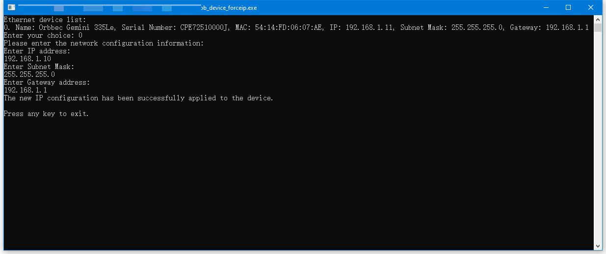

# Force IP

This sample configures the IP address of a supported Ethernet device with the GigE Vision Force IP command.

## When To Use It

- assign a reachable IP address to a network camera
- recover a device whose current IP is outside your local subnet
- verify basic Ethernet device discovery and network configuration

## Supported Devices

| Device Series | Models |
|---------------|--------|
| Gemini 330 Series | Gemini 335Le |
| Gemini 435 Series | Gemini 435Le |
| Femto Series |  Femto Mega, Femto Mega I |

## Prerequisites

- Build the examples from the repository root as described in [../../README.md](../../README.md)
- A supported Ethernet device must be connected

## Build & Run

```bash
cmake -S . -B build -DOB_BUILD_EXAMPLES=ON
cmake --build build --config Release --target ob_device_forceip
```

```bash
.\build\win_x64\bin\ob_device_forceip.exe     # Windows
./build/linux_x86_64/bin/ob_device_forceip    # Linux x86_64
./build/linux_arm64/bin/ob_device_forceip     # Linux ARM64
./build/macOS/bin/ob_device_forceip           # macOS
```

## How To Use It

1. Start the sample.
2. Select one of the discovered Ethernet devices.
3. Enter the new IP address.
4. Enter the subnet mask.
5. Enter the gateway address.
6. The sample applies the new network configuration and prints the result.

## Notes

- For Gemini 335Le and Gemini 435Le, Force IP is temporary and is lost after reboot.
- The sample lists only Ethernet-connected devices.

## Result


