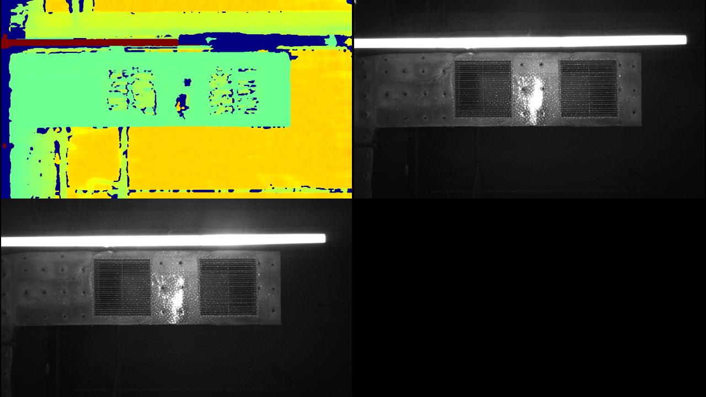
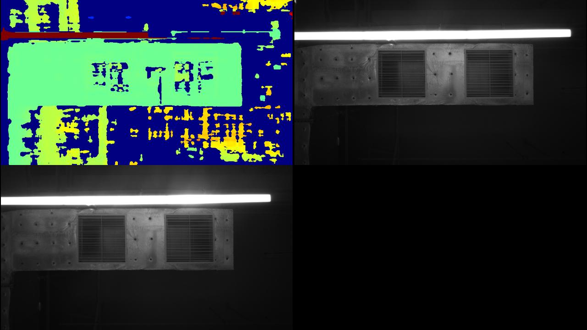

# Laser Interleave

This sample demonstrates frame interleave with laser on/off sequences and lets you filter frames by sequence ID.

## When To Use It

- evaluate devices that support frame interleave
- compare depth and IR output under different laser states
- learn how to use the `SequenceIdFilter`

## Prerequisites

- Build the examples from the repository root as described in [../../README.md](../../README.md)
- OpenCV is required for the display window
- The connected device must support frame interleave

## Build & Run

```bash
cmake -S . -B build -DOB_BUILD_EXAMPLES=ON -DOpenCV_DIR=/path/to/opencv
cmake --build build --config Release --target ob_laser_interleave
```

```bash
.\build\win_x64\bin\ob_laser_interleave.exe     # Windows
./build/linux_x86_64/bin/ob_laser_interleave    # Linux x86_64
./build/linux_arm64/bin/ob_laser_interleave     # Linux ARM64
./build/macOS/bin/ob_laser_interleave           # macOS
```

## Operation

- The sample opens a preview window and a terminal command loop.
- Press `Esc` in the window to exit.
- In the terminal, use the following command format:

`<filter> <param>`

Available filters:

- `depth`
- `left_ir`
- `right_ir`

Available parameters:

- `all` - disable sequence filtering
- `0` - show sequence 0 only
- `1` - show sequence 1 only

Exit commands:

- `q`
- `quit`

## Notes

- The sample loads the `Laser On-Off` frame-interleave mode automatically.
- The original README notes Gemini 330 series support.

## Result

1. Sequence 0 example:



2. Sequence 1 example:


