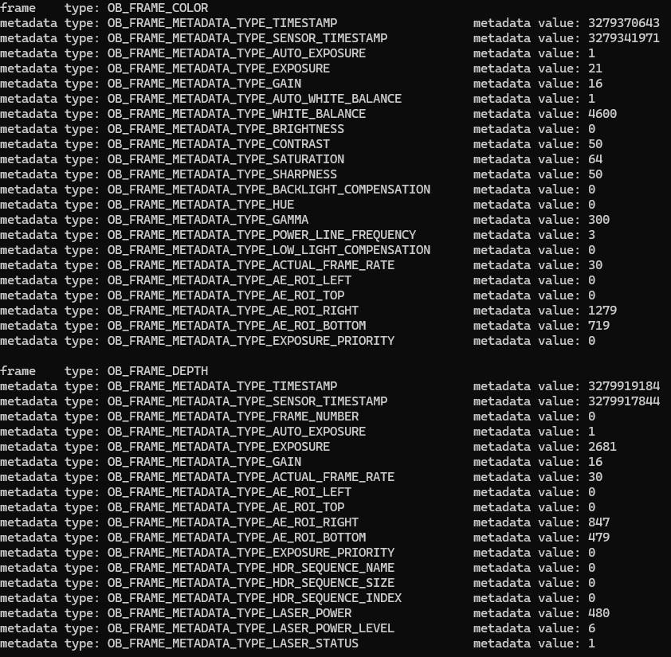

# Metadata

This sample prints frame metadata values from the active streams in the terminal.
Use it when you need to inspect timestamps, exposure information, frame counters, and other metadata fields emitted by the device.

## When To Use It

- inspect per-frame metadata
- debug timestamps and frame numbering
- verify whether a specific metadata field is present on a device

## Prerequisites

- Build the examples from the repository root as described in [../../README.md](../../README.md)
- No OpenCV dependency is required

## Build & Run

```bash
cmake -S . -B build -DOB_BUILD_EXAMPLES=ON
cmake --build build --config Release --target ob_metadata
```

```bash
.\build\win_x64\bin\ob_metadata.exe     # Windows
./build/linux_x86_64/bin/ob_metadata    # Linux x86_64
./build/linux_arm64/bin/ob_metadata     # Linux ARM64
./build/macOS/bin/ob_metadata           # macOS
```

## Operation

- The sample starts the default pipeline automatically.
- Metadata is printed in the terminal every 30 frames for the frames that expose metadata fields.
- Press `Esc` to stop the sample.

## Result


