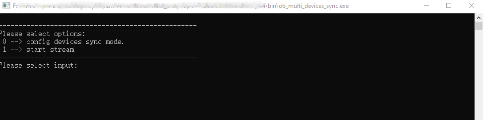
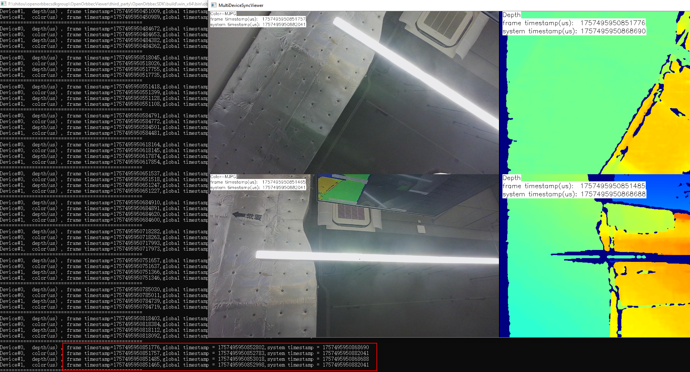
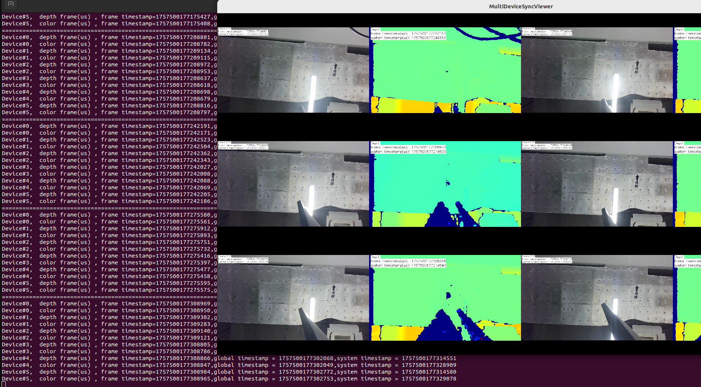

# Multi Devices Sync

This sample demonstrates multi-device synchronization for supported USB, Ethernet, and GMSL devices.
It is intended for users who need to verify timestamp alignment and synchronized preview across more than one camera.

## When To Use It

- validate hardware synchronization between multiple devices
- compare timestamps across synchronized depth and color streams
- test `PRIMARY` / `SECONDARY` / trigger-based sync modes
- preview synchronized results before integrating the logic into your own application

## Supported Devices

| Device Series | Models |
|---------------|--------|
| Gemini 330 Series | Gemini 330, Gemini 330L, Gemini 335, Gemini 335L, Gemini 335Le, Gemini 336, Gemini 336L, Gemini 335Lg |
| Gemini 305 Series | Gemini 305 |
| Gemini 340 Series | Gemini 345, Gemini 345Lg |
| Gemini 435 Series | Gemini 435Le |
| Gemini 2 Series | Gemini 2, Gemini 2L, Gemini 215, Gemini 210 |
| Femto Series | Femto Bolt, Femto Mega, Femto Mega I |
| Astra Series | Astra 2 |


> Refer to the [Supported Devices and Firmware](https://github.com/orbbec/OrbbecSDK_v2?tab=readme-ov-file#supported-devices-and-firmware) section in the main README for more details.

## Prerequisites

- Build the examples from the repository root as described in [../../README.md](../../README.md)
- OpenCV is required for the preview window
- At least two supported devices are required for a meaningful synchronization test

Hardware notes:

- USB and Ethernet devices using the 8-pin synchronization path should be connected through a sync hub
- GMSL devices can use either the 8-pin path or GMSL2 / FAKRA synchronization, depending on the hardware setup

Reference documents:

- Multi-device sync guide: <https://www.orbbec.com/docs-general/set-up-cameras-for-external-synchronization_v1-2/>
- Gemini 335Lg GMSL sync guide: <https://www.orbbec.com/docs/gemini-335lg-hardware-synchronization/>

## Build & Run

```bash
cmake -S . -B build -DOB_BUILD_EXAMPLES=ON -DOpenCV_DIR=/path/to/opencv
cmake --build build --config Release --target ob_multi_devices_sync
```

```bash
.\build\win_x64\bin\ob_multi_devices_sync.exe     # Windows
./build/linux_x86_64/bin/ob_multi_devices_sync    # Linux x86_64
./build/linux_arm64/bin/ob_multi_devices_sync     # Linux ARM64
./build/macOS/bin/ob_multi_devices_sync           # macOS
```

## What This Sample Does

1. When you choose menu option `0`, loads the synchronization settings from [MultiDeviceSyncConfig.json](MultiDeviceSyncConfig.json)
2. Applies the configured sync mode to the matching devices
3. Starts depth and color streams for each device
4. Pairs frames across devices by timestamp
5. Displays synchronized frame pairs in one window and prints timestamp information in the terminal

## Configuration File

When you choose menu option `0`, the sample reads its device sync settings from:

`MultiDeviceSyncConfig.json`

Important:

- The code reads `./MultiDeviceSyncConfig.json` from the current working directory.
- If you launch the executable from a build output directory, make sure this JSON file is present in that same working directory before selecting menu option `0`.
- Menu option `1` starts streaming with the devices' current sync configuration and does not load the JSON file.

Each device entry contains:

- `sn` - the device serial number
- `syncMode` - the synchronization mode for that device
- `depthDelayUs` - depth trigger delay
- `colorDelayUs` - color trigger delay
- `trigger2ImageDelayUs` - delay between trigger and image capture
- `triggerOutEnable` - whether the device outputs a trigger signal
- `triggerOutDelayUs` - trigger output delay
- `framesPerTrigger` - number of frames captured for each trigger in trigger mode

### Common Sync Strategies

For USB and Ethernet devices, the sample supports these typical configurations:

1. One `PRIMARY` device and the remaining devices as `SECONDARY`
2. One `SOFTWARE_TRIGGERING` device and the remaining devices as `HARDWARE_TRIGGERING`
3. All devices as `SECONDARY`, driven by an external trigger source

## Menu Options

When the sample starts, the terminal shows:

- `0` - configure device sync mode from the JSON file, then start the stream
- `1` - start the stream directly using the device's current sync configuration

## Preview Window Controls

| Key | Action |
| --- | --- |
| `S` | Manually request device clock synchronization |
| `T` | Send one software trigger to devices in `SOFTWARE_TRIGGERING` mode |
| `Esc` | Close the preview window and stop streaming |

## Windows Workflow

Typical flow:

1. Prepare the hardware synchronization wiring and the JSON configuration file.
2. Start `ob_multi_devices_sync`.
3. Select `0` to apply the JSON config and start streaming.
4. Watch the preview window and compare timestamps printed in the terminal.

Result example:



Synchronized preview example:



## Linux / ARM64 Workflow

### USB or Ethernet devices

Run the sample normally:

```bash
./build/linux_arm64/bin/ob_multi_devices_sync
```

Then choose:

- `0` if you want the sample to apply the JSON configuration first
- `1` if the devices are already configured and you only want to start the stream

### GMSL devices over GMSL2 / FAKRA

For this workflow you typically need two samples:

1. `ob_multi_devices_sync` for stream preview and timestamp comparison
2. `ob_multi_devices_sync_gmsltrigger` for PWM trigger generation

Recommended steps:

1. Open the first terminal and run `ob_multi_devices_sync`
2. Select `0` to load and apply the sync configuration
3. Open the second terminal and run [../multi_devices_sync_gmsltrigger/README.md](../multi_devices_sync_gmsltrigger/README.md)
4. Configure the trigger frequency and start the PWM trigger
5. Return to the preview window and verify synchronization behavior

## GMSL Notes

- If you use the 8-pin path on GMSL devices, the setup is similar to USB and Ethernet multi-device synchronization
- If you use GMSL2 / FAKRA, PWM trigger control is handled by the separate `ob_multi_devices_sync_gmsltrigger` sample
- For `SECONDARY` mode, the PWM trigger frequency should match the actual streaming frame rate
- For `HARDWARE_TRIGGERING` mode, the PWM trigger should not exceed half of the configured stream frame rate

## What To Look For In The Result

- paired depth and color frames from each device appear together in the preview window
- timestamps printed in the terminal are close or equal across synchronized devices
- manual software triggering works when the device is configured for `SOFTWARE_TRIGGERING`

AGX Orin example:


