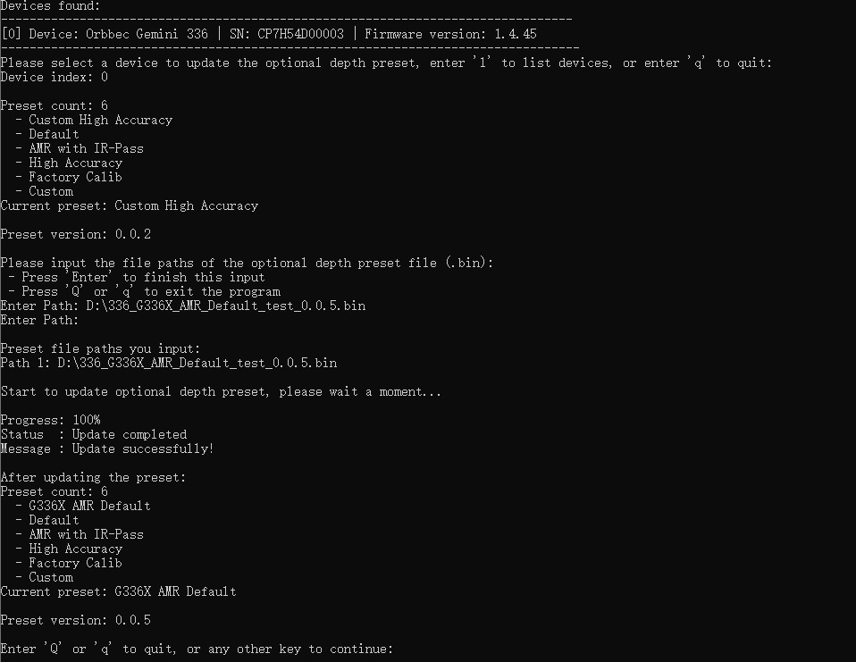

# Optional Depth Presets Update

This sample updates optional depth preset files on a supported device.

## When To Use It

- load additional depth presets onto a device
- validate preset update workflows during manufacturing or testing
- check the preset list before and after an update

## Prerequisites

- Build the examples from the repository root as described in [../../README.md](../../README.md)
- The connected device must support optional depth presets
- Prepare one or more preset `.bin` files

## Build & Run

```bash
cmake -S . -B build -DOB_BUILD_EXAMPLES=ON
cmake --build build --config Release --target ob_device_optional_depth_presets_update
```

```bash
.\build\win_x64\bin\ob_device_optional_depth_presets_update.exe     # Windows
./build/linux_x86_64/bin/ob_device_optional_depth_presets_update    # Linux x86_64
./build/linux_arm64/bin/ob_device_optional_depth_presets_update     # Linux ARM64
./build/macOS/bin/ob_device_optional_depth_presets_update           # macOS
```

## How To Use It

1. Select a device from the list.
2. Enter one preset `.bin` path per line.
3. Press `Enter` on an empty line to finish path input.
4. The sample starts the update and prints progress, status, and message output.
5. Review the preset list again after a successful update.

## Notes

- Press `Q` or `q` during the input stage to exit.
- Do not unplug the device during the update.
- The original sample notes that a restart is not required after the update completes.

## Result


