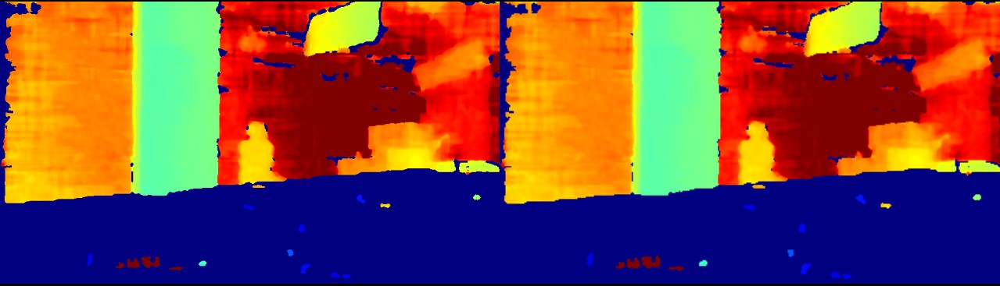

# Post Processing

This sample demonstrates the recommended depth post-processing filters provided by the SDK.
It shows the raw depth output and the processed result side by side while letting you inspect and modify filter settings from the terminal.

## When To Use It

- learn which depth post-processing filters are recommended for the current device
- compare raw depth output with filtered output
- tune filter parameters interactively

## Prerequisites

- Build the examples from the repository root as described in [../../README.md](../../README.md)
- OpenCV is required for the display window

## Build & Run

```bash
cmake -S . -B build -DOB_BUILD_EXAMPLES=ON -DOpenCV_DIR=/path/to/opencv
cmake --build build --config Release --target ob_post_processing
```

```bash
.\build\win_x64\bin\ob_post_processing.exe     # Windows
./build/linux_x86_64/bin/ob_post_processing    # Linux x86_64
./build/linux_arm64/bin/ob_post_processing     # Linux ARM64
./build/macOS/bin/ob_post_processing           # macOS
```

## How To Use It

Window behavior:

- the left side shows the original depth frame
- the right side shows the processed frame
- press `Esc` to exit

Terminal commands:

- `L` or `l` - list all available filters
- `H` or `h` - print help
- `Q` or `q` - quit
- `[Filter]` - show current config values for a filter
- `[Filter] on` or `[Filter] off` - enable or disable a filter
- `[Filter] list` - show the config schema for a filter
- `[Filter] [Config]` - show the current value of a config item
- `[Filter] [Config] [Value]` - set a new config value

## Result


