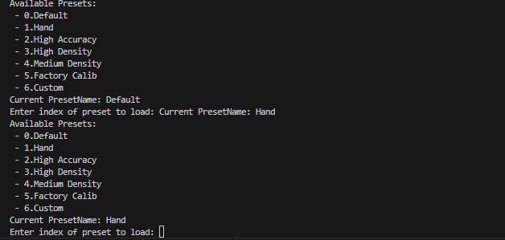

# Preset

This sample lists the available device presets and lets you load them by index.

## When To Use It

- inspect which presets are available on the current device
- switch between presets during evaluation
- verify which preset is currently active

## Supported Devices

| Device Series | Models |
|---------------|--------|
| Gemini 330 Series | Gemini 330, Gemini 330L, Gemini 335, Gemini 335L, Gemini 335Le, Gemini 336, Gemini 336L, Gemini 335Lg |
| Gemini 305 Series | Gemini 305 |
| Gemini 340 Series | Gemini 345, Gemini 345Lg |
| Gemini 435 Series | Gemini 435Le |
| Gemini 2 Series | Gemini 2, Gemini 2L, Gemini 215, Gemini 210 |
| Femto Series | Femto Bolt, Femto Mega, Femto Mega I |
| Astra Series | Astra 2 |


> Refer to the [Supported Devices and Firmware](https://github.com/orbbec/OrbbecSDK_v2?tab=readme-ov-file#supported-devices-and-firmware) section in the main README for more details.

## Prerequisites

- Build the examples from the repository root as described in [../../README.md](../../README.md)
- The connected device must support presets

## Build & Run

```bash
cmake -S . -B build -DOB_BUILD_EXAMPLES=ON
cmake --build build --config Release --target ob_preset
```

```bash
.\build\win_x64\bin\ob_preset.exe     # Windows
./build/linux_x86_64/bin/ob_preset    # Linux x86_64
./build/linux_arm64/bin/ob_preset     # Linux ARM64
./build/macOS/bin/ob_preset           # macOS
```

## How To Use It

1. Start the sample.
2. Review the preset list printed in the terminal.
3. Check the current preset name.
4. Enter the index of the preset to load.
5. The sample prints the active preset again after loading.

## Notes

- The sample stays in the preset-selection loop so you can switch presets repeatedly.
- There is currently no dedicated quit command in this sample. End the session from the terminal when you are finished.

## Result


