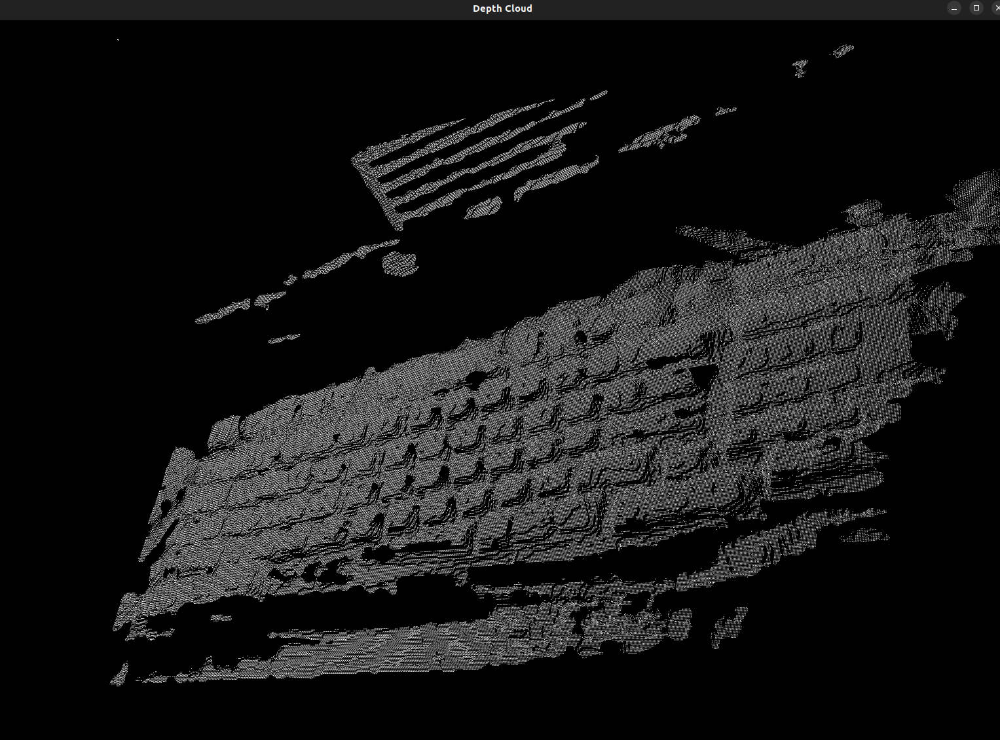

# PCL Point Cloud

This example converts SDK point-cloud output into `pcl::PointCloud<pcl::PointXYZ>` and renders it with the PCL visualizer.

## When To Use It

- generate an XYZ point cloud from Orbbec depth data
- verify that your PCL environment is working with OrbbecSDK
- use a minimal PCL-based example before moving to color point clouds

## Prerequisites

- Build the examples from the repository root as described in [../README.md](../README.md)
- PCL must be installed and discoverable by CMake

## Build & Run

```bash
cmake -S . -B build -DOB_BUILD_EXAMPLES=ON -DOB_BUILD_PCL_EXAMPLES=ON -DPCL_DIR=/path/to/PCL
cmake --build build --config Release --target ob_pcl
```

```bash
.\build\win_x64\bin\ob_pcl.exe     # Windows
./build/linux_x86_64/bin/ob_pcl    # Linux x86_64
./build/linux_arm64/bin/ob_pcl     # Linux ARM64
./build/macOS/bin/ob_pcl           # macOS
```

## How It Works

1. Start a pipeline and capture frames.
2. Generate SDK point-cloud data from the depth frame.
3. Convert the SDK point cloud into `pcl::PointCloud<pcl::PointXYZ>`.
4. Render the cloud with the PCL visualizer.

## Operation

- Rotate and inspect the point cloud in the PCL window.
- Press `Q` in the PCL window to exit.

## Result


