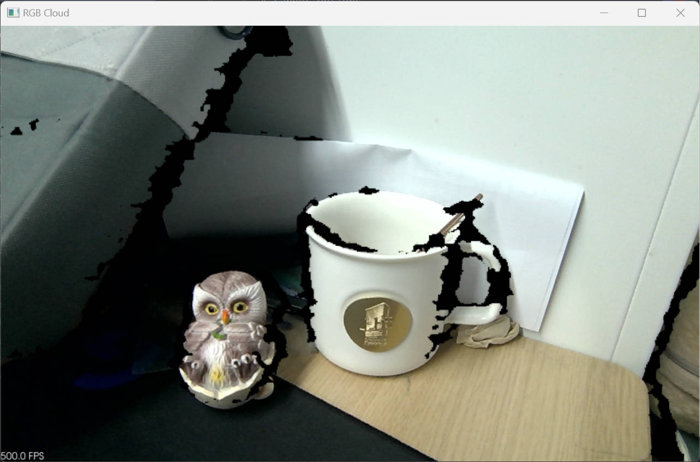

# PCL Color Point Cloud

This example creates an RGB point cloud by combining aligned color and depth data, then renders it with the PCL visualizer.

## When To Use It

- generate a colored point cloud instead of geometry-only XYZ points
- validate aligned RGB-D data before integrating with your own PCL pipeline
- compare plain depth point clouds with RGB point clouds

## Prerequisites

- Build the examples from the repository root as described in [../README.md](../README.md)
- PCL must be installed and discoverable by CMake

## Build & Run

```bash
cmake -S . -B build -DOB_BUILD_EXAMPLES=ON -DOB_BUILD_PCL_EXAMPLES=ON -DPCL_DIR=/path/to/PCL
cmake --build build --config Release --target ob_pcl_color
```

```bash
.\build\win_x64\bin\ob_pcl_color.exe     # Windows
./build/linux_x86_64/bin/ob_pcl_color    # Linux x86_64
./build/linux_arm64/bin/ob_pcl_color     # Linux ARM64
./build/macOS/bin/ob_pcl_color           # macOS
```

## How It Works

1. Start synchronized color and depth streaming.
2. Align the depth frame to the color frame.
3. Convert the aligned result into RGB point-cloud format.
4. Convert the SDK point cloud into `pcl::PointCloud<pcl::PointXYZRGB>`.
5. Save the generated point cloud to `output.pcd` in the current working directory.
6. Load the saved `.pcd` file and render it in the PCL viewer.

## Operation

- The sample writes `output.pcd` to the current working directory before visualization.
- Rotate and inspect the color point cloud in the PCL window.
- Press `Q` in the PCL window to exit.

## Result


