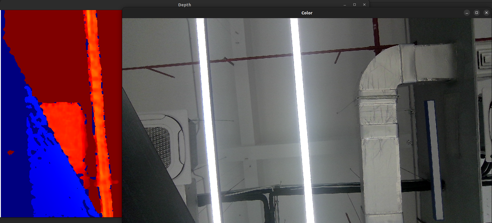

# Open3D Wrapper

This example captures synchronized color and depth frames and renders them in real time with Open3D.

## About Open3D

Open3D is an open-source library for 3D data processing and visualization.
It is a good fit when you want to work with RGB-D images, point clouds, and interactive 3D rendering.

## What This Example Does

1. Enables synchronized color and depth streams.
2. Forces complete framesets with `OB_FRAME_AGGREGATE_OUTPUT_ALL_TYPE_FRAME_REQUIRE`.
3. Converts SDK frame buffers into Open3D image tensors.
4. Renders color and depth images in Open3D windows.
5. Stops when you press `Esc` in either Open3D window.

## Build and Run

Build from the repository root with Open3D examples enabled:

```bash
cmake -S . -B build -DOB_BUILD_EXAMPLES=ON -DOB_BUILD_OPEN3D_EXAMPLES=ON -DOpen3D_DIR=/path/to/Open3D
cmake --build build --config Release --target ob_open3d
```

```bash
.\build\win_x64\bin\ob_open3d.exe      # Windows
./build/linux_x86_64/bin/ob_open3d     # Linux x86_64
./build/linux_arm64/bin/ob_open3d      # Linux ARM64
./build/macOS/bin/ob_open3d            # macOS
```

## How It Works

1. Configure the output format of color and depth frames.

    ```cpp
    auto pipeline = std::make_shared<ob::Pipeline>();

    std::shared_ptr<ob::Config> config = std::make_shared<ob::Config>();

    config->enableVideoStream(OB_STREAM_COLOR, OB_WIDTH_ANY, OB_HEIGHT_ANY, OB_FPS_ANY, OB_FORMAT_RGB);
    config->enableVideoStream(OB_STREAM_DEPTH, OB_WIDTH_ANY, OB_HEIGHT_ANY, OB_FPS_ANY, OB_FORMAT_Y16);
    config->setFrameAggregateOutputMode(OB_FRAME_AGGREGATE_OUTPUT_ALL_TYPE_FRAME_REQUIRE);
    pipeline->enableFrameSync();
    ```

2. Retrieve synchronized frames.

    ```cpp
    auto frameset = pipeline->waitForFrames();
    if(!frameset) {
        continue;
    }

    auto colorFrame = frameset->getFrame(OB_FRAME_COLOR)->as<ob::ColorFrame>();
    auto depthFrame = frameset->getFrame(OB_FRAME_DEPTH)->as<ob::DepthFrame>();
    ```

3. Convert SDK data to Open3D tensors.

    ```cpp
    std::shared_ptr<t::geometry::RGBDImage> preRgbd = std::make_shared<t::geometry::RGBDImage>();

    preRgbd->color_ =
        core::Tensor(static_cast<const uint8_t *>(colorFrame->getData()), { colorFrame->getHeight(), colorFrame->getWidth(), 3 }, core::Dtype::UInt8);
    preRgbd->depth_ =
        core::Tensor(reinterpret_cast<const uint16_t *>(depthFrame->getData()), { depthFrame->getHeight(), depthFrame->getWidth() }, core::Dtype::UInt16);
    ```

4. Render in Open3D windows.

    ```cpp
    if(!windowsInited) {
        if(!colorVis.CreateVisualizerWindow("Color", 1280, 720) || !colorVis.AddGeometry(colorImage)) {
            return 0;
        }

        if(!depthVis.CreateVisualizerWindow("Depth", 1280, 720) || !depthVis.AddGeometry(depthImage)) {
            return 0;
        }
        windowsInited = true;
    }
    else {
        colorVis.UpdateGeometry(colorImage);
        depthVis.UpdateGeometry(depthImage);
    }
    ```

## Result


