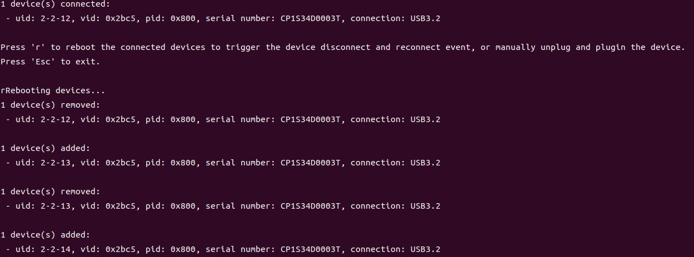

# Hot Plug

This example demonstrates how to detect device disconnect and reconnect events.
It is useful when your application must respond to users unplugging or reconnecting a camera while the program is running.

## When To Use It

- test device hot-plug behavior
- verify that the SDK callback is triggered on disconnect and reconnect
- build applications that must survive cable unplug and device reboot events

## Supported Devices

| Device Series | Models |
|---------------|--------|
| Gemini 330 Series | Gemini 330, Gemini 330L, Gemini 335, Gemini 335L, Gemini 335Le, Gemini 336, Gemini 336L, Gemini 335Lg |
| Gemini 305 Series | Gemini 305 |
| Gemini 340 Series | Gemini 345, Gemini 345Lg |
| Gemini 435 Series | Gemini 435Le |
| Gemini 2 Series | Gemini 2, Gemini 2L, Gemini 215, Gemini 210 |
| Femto Series | Femto Bolt, Femto Mega, Femto Mega I |
| Astra Series | Astra 2 |
| Astra Mini Series | Astra Mini Pro, Astra Mini S Pro |

> Refer to the [Supported Devices and Firmware](https://github.com/orbbec/OrbbecSDK_v2?tab=readme-ov-file#supported-devices-and-firmware) section in the main README for more details.

## Prerequisites

- Build the examples from the repository root as described in [../../README.md](../../README.md)
- GMSL devices such as Gemini 335Lg do not support hot plugging

## Build & Run

```bash
cmake -S . -B build -DOB_BUILD_EXAMPLES=ON
cmake --build build --config Release --target ob_hot_plugin
```

```bash
.\build\win_x64\bin\ob_hot_plugin.exe     # Windows
./build/linux_x86_64/bin/ob_hot_plugin    # Linux x86_64
./build/linux_arm64/bin/ob_hot_plugin     # Linux ARM64
./build/macOS/bin/ob_hot_plugin           # macOS
```

## Controls

| Key | Action |
| --- | --- |
| `R` | Reboot the currently connected device to trigger disconnect and reconnect callbacks |
| `Esc` | Exit |

You can also manually unplug and reconnect the device to observe the callback behavior.

## What You Will See

- callback output when devices are removed
- callback output when devices are added again
- device identity information such as UID, PID, serial number, and connection type

## Result


