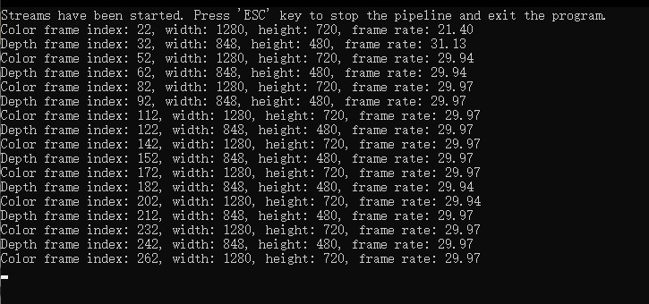

# Quick Start with C

This is the minimal C API example for starting the default device streams.
Use it when you want the smallest possible C-language entry point before moving on to larger C examples.

## When To Use It

- verify that the SDK C API is working
- start streaming from a C program with minimal setup
- use a small reference before moving to device enumeration or depth-only processing

## Prerequisites

- Build the examples from the repository root as described in [../../README.md](../../README.md)
- No OpenCV dependency is required

## Build & Run

```bash
cmake -S . -B build -DOB_BUILD_EXAMPLES=ON
cmake --build build --config Release --target ob_quick_start_c
```

```bash
.\build\win_x64\bin\ob_quick_start_c.exe     # Windows
./build/linux_x86_64/bin/ob_quick_start_c    # Linux x86_64
./build/linux_arm64/bin/ob_quick_start_c     # Linux ARM64
./build/macOS/bin/ob_quick_start_c           # macOS
```

## What The Sample Does

1. Creates a pipeline with the SDK C API
2. Starts the default streams
3. Waits for framesets in a loop
4. Prints frame-rate information
5. Exits when you press `Esc`

## Result


