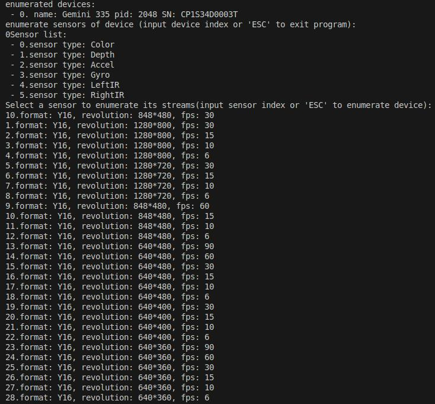

# Enumerate with C

This C API sample helps you inspect connected devices, sensors, and stream profiles from the terminal.

## When To Use It

- discover devices through the C API
- inspect available sensors and stream profiles
- confirm what the current device supports before writing a larger C application

## Prerequisites

- Build the examples from the repository root as described in [../../README.md](../../README.md)
- No OpenCV dependency is required

## Build & Run

```bash
cmake -S . -B build -DOB_BUILD_EXAMPLES=ON
cmake --build build --config Release --target ob_enumerate_c
```

```bash
.\build\win_x64\bin\ob_enumerate_c.exe     # Windows
./build/linux_x86_64/bin/ob_enumerate_c    # Linux x86_64
./build/linux_arm64/bin/ob_enumerate_c     # Linux ARM64
./build/macOS/bin/ob_enumerate_c           # macOS
```

## How To Use It

1. Start the sample.
2. Select a device index to inspect the device.
3. Inspect the sensor list.
4. Select a sensor index to inspect its available stream profiles.
5. Enter `q` when you want to exit.

## What You Will See

- device information
- sensor list
- stream profile information such as format, resolution, FPS, and index

## Result


